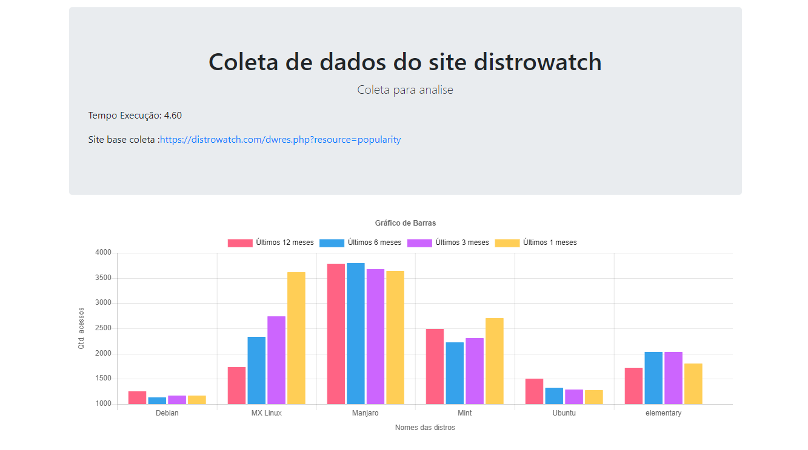

# Coleta de dados do site distrowatch 
Coleta de dados usando web scraping com python e django  
no site **https://distrowatch.com/dwres.php?resource=popularity**
 
# instalação 

git clone <strong>https://github.com/ClebsonFerreira/analise.git</strong>

virtualenv <strong>venv</strong>

<strong>pip install -r requirements.txt</strong>

<strong>python manager.py runserver</strong>

<strong> <a href="http://localhost:8000/app"> http://localhost:8000/app </a></strong>

 

obs. no gráfico so e mostrado as distros que contém mais de 1000 acesso

